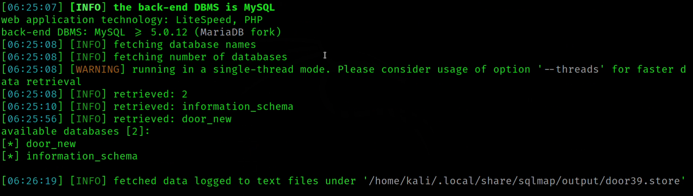

🎯 **Today's Focus: The door39.store Website** 🎯

I embarked on exploring the juc.edu.bd website, adhering to the guidelines set by my instructor for a vulnerability assessment task. My initial step was to conduct a WHOIS lookup to ascertain the website's origins.

**What is SQL Injection💉?**

SQL Injection is a code injection technique where an attacker executes malicious SQL queries that control a web application’s database. With the right set of queries, a user can gain access to information stored in databases. SQLMAP tests whether a ‘GET’ parameter is vulnerable to SQL Injection. 

**Where can you use SQLMAP💀?**

If you observe a web url that is of the form http://testphp.vulnweb.com/listproducts.php?cat=1, where the ‘GET’ parameter is in bold, then the website may be vulnerable to this mode of SQL injection, and an attacker may be able to gain access to information in the database. Furthermore, SQLMAP works when it is php based. 


**Step 1: List information about the existing databases📚** 

So firstly, we have to enter the web url that we want to check along with the -u parameter. We may also use the –tor parameter if we wish to test the website using proxies. Now typically, we would want to test whether it is possible to gain access to a database. So we use the –dbs option to do so. –dbs lists all the available databases. 
```
 sqlmap -u website url --dbs 
```




**Step 2: List information about Tables present in a particular Database📚💻** 

To try and access any of the databases, we have to slightly modify our command. We now use -D to specify the name of the database that we wish to access, and once we have access to the database, we would want to see whether we can access the tables. For this, we use the –tables query. Let us access the accurate database. 
```
sqlmap -u website url -D acuart --tables
```


**Step 3: List information about the columns of a particular table💻** 

If we want to view the columns of a particular table, we can use the following command, in which we use -T to specify the table name, and –columns to query the column names. We will try to access the table ‘artists’. 
```
sqlmap -u website url -D acuart -T artists --columns

``` 


**Step 4: Dump the data from the columns💻**

Similarly, we can access the information in a specific column by using the following command, where -C can be used to specify multiple column name separated by a comma, and the –dump query retrieves the data 
```
sqlmap -u website url -D acuart -T artists -C aname --dump
``` 


# Prevent SQL Injection💀

**SQL injection can be generally prevented by using Prepared Statements . When we use a prepared statement, we are basically using a template for the code and analyzing the code and user input separately. It does not mix the user entered query and the code. In the example given at the beginning of this article, the input entered by the user is directly inserted into the code and they are compiled together, and hence we are able to execute malicious code. For prepared statements, we basically send the sql query with a placeholder for the user input and then send the actual user input as a separate command.**

Consider the following php code segment. 
```
$db = new PDO('connection details');
$stmt = db->prepare("Select name from users where id = :id");
$stmt->execute(array(':id', $data));
```
